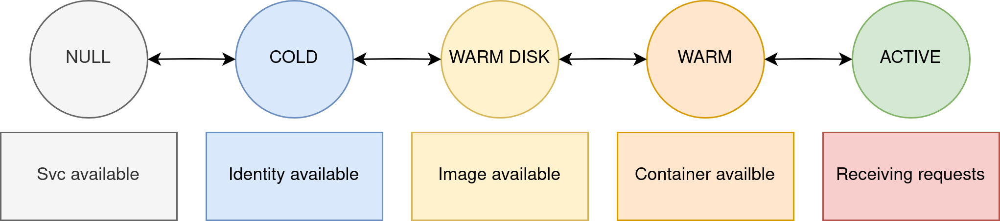
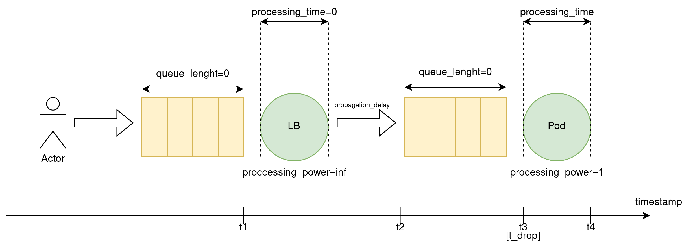

# simu-serverless: A trace-driven Function-as-a-Service simulator
In this work, we defines distinct operational states for Kubernetes pods, characterized by differential CPU and RAM consumption profiles specific to each state.

# State architecture
The `simu-serverless` simulation framework defines distinct operational states for Kubernetes pods, as previously outlined. For each of these defined states, Application Programming Interfaces (APIs) are provided to enable more formal and precise control over pod statuses.\
All functionalities pertaining to the manipulation of pod states are implemented under `./ikukantai/system/scheduler/autoscaler.py`.

<br/>

> Pod state transitions are restricted: A pod can only move to a directly subsequent state or a predefined alternative state. For example, a pod currently in the `warmdisk` state may only transition to the `warm` state or the `cold` state, and cannot transition directly to the `null` state.

## Null state
The starting assumption is that all services have been set up in the simulated cluster. In the `null` state, this indicates there is no actual pod, though its service is still defined. 
```python
# API to change a pod to *null* state
yield env.process(
   StateAPI.to_null(env=self.env, main_monitor=self.main_monitor, function_name=self.fn_name, pod_name='1')
)
```

## Cold state
In the `cold` state, an identifier is assigned to each pod. This identifier serves as an abstract representation, indicating the pod's existence to the system.
```python
# API to change a pod to *cold* state
yield env.process(
   StateAPI.to_cold(env=self.env, main_monitor=self.main_monitor, function_name=self.fn_name, pod_name='1')
)
```

## Warmdisk
In the `warmdisk` state, image is availabled for deployment of pod in next states.
```python
# API to change a pod to *warmdisk* state
yield env.process(
   StateAPI.to_warmdisk(env=self.env, main_monitor=self.main_monitor, function_name=self.fn_name, pod_name='1', node=chosen_node)
)
```
`chosen_node` is taken as below
```python
node_idx = 3
chosen_node: Node = self.env.cluster.list_nodes()[node_idx]
```

## Warm
In the `warm` state, a physical pod is deployed into the system and wait for incoming request.
```python
# API to change a pod to *warm* state
yield env.process(
   StateAPI.to_warm(env=self.env, main_monitor=self.main_monitor, function_name=self.fn_name, pod_name='1', node=chosen_node)  
)
```

## Active
In the `active` state, the pod is receiving and processing requests. In this work, we focused on how pod scaling, not focus on loadbalancing the requests into pods.

# System information collector
All information about system (needed timestamp, CPU, RAM usages) is collected through `self.main_monitor`

## CPU and RAM usages
CPU and RAM usages is collected every 2 seconds (0, 2, 4, ...) and can be accessed as below.
```python 
# CPU and RAM usage is a store in a dict
self.main_monitor.cpu_usage
self.main_monitor.ram_usage

# You can access CPU usage in specific node by
self.main_monitor.cpu_usage["node_name"] # This will return a dict: *timestamp: cpu_usage*
self.main_monitor.ram_usage["node_name"] # This will return a dict: *timestamp: ram_usage*
```

## Timestamp
Timestamp collection is described as below. All about request timestamp is collected through `self.main_monitor`.
<br/>

```python
# Timestamp is store through a dict
self.main_monitor.timestamp

# You can access timestamp each request by
# *request_x* is an instance of class *FunctionRequest*
self.main_monitor.timestamp[<request_x>]["t_1"] # Accessing timestamp "t1" of request request_x. 

# FunctionRequest is a class that describe a simulated request in our simulation
class FunctionRequest:
    request_id: int
    name: str # Function name
    size: float = None

    id_generator = counter()

    def __init__(self, name, size=None) -> None:
        super().__init__()
        self.name = name
        self.size = size
        self.request_id = next(self.id_generator)

    def __str__(self) -> str:
        return 'FunctionRequest(%d, %s, %s)' % (self.request_id, self.name, self.size)

    def __repr__(self):
        return self.__str__()
```

# Run simulation

You can run the simulation we provide in `./ikukantai` by first creating a virtual environment and installing the necessary dependencies.

```bash
make venv
source .venv/bin/activate
cd ikukantai
python main.py
```


